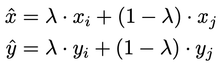
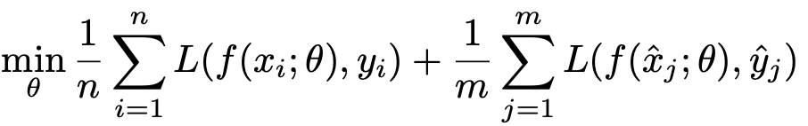
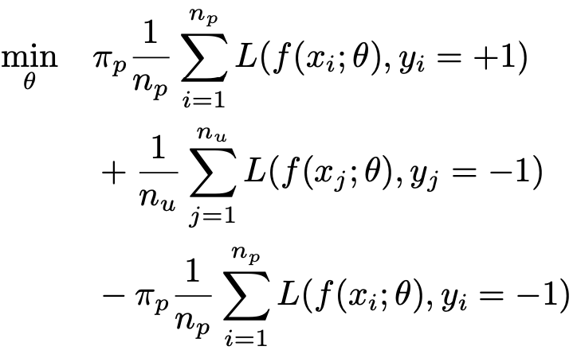
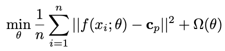

# Algorithms in ATLearn

ATLearn includes several image classification and object detection algorithms. We
introduce them here to help customers choose the appropriate algorithm based on their own data sets.

## Outline
In `task.py`, it has two tasks: image classification and object detection. Thus, users can
choose which task they have, e.g., 
```
task.IMAGE_CLASSIFICATION
task.OBJECT_DETECTION
```

In `task.py`, it also provides 5 different algorithms. For the task of image classification,
i.e., `task.IMAGE_CLASSIFICATION`, it has
```
algorithm.IC_STANDARD_TRANSFER
algorithm.IC_POSITIVE_UNLABELED
algorithm.IC_ONE_CLASS
algorithm.REGRESSION
```

For the task of object detection, i.e., `task.OBJECT_DETECTION`, it has
```
algorithm.OD_STANDARD_TRANSFER
```

## Description
* `algorithm.IC_STANDARD_TRANSFER`

The goal of transfer learning in this case is to encourage the fast
convergence regarding the model performance. For example, when
increasing the number of training samples, the model performance will
improve. Finally, it will converge to some point, i.e., increasing
training examples will not affect the model performance any more.
Inspired by this idea, we can use data augmentation approaches to
generate some synthetic samples so that the model performance has fast
convergence rate with respect to the number of training samples provided
by the customers. To this end, we use a simple data augmentation method
called [mixup](https://arxiv.org/abs/1710.09412) . For any two real training samples
(*x*<sub>*i*</sub>,*y*<sub>*i*</sub>) and
(*x*<sub>*j*</sub>,*y*<sub>*j*</sub>), the synthetic sample can be given
by
<p align="center">
  
</p>
where $\lambda \sim \text{Beta}(\alpha, \alpha)$ ($\alpha > 0$) is
randomly drawn from a beta distribution. Then the objective function can be rewritten as follows.
<p align="center">
  
</p>

* `algorithm.REGRESSION`

It is similar to `algorithm.IC_STANDARD_TRANSFER`. The difference is that we use 
cross-entropy loss for classification tasks, but mean square error for regression tasks here.

* `algorithm.IC_POSITIVE_UNLABELED`

Given a training set, only some training samples have class labels. 
Notice that it is different from standard semi-supervised learning,
which has few training samples from each class. Instead, in this scenario, 
all the labeled samples belong to the positive class, e.g., fresh apples. 
The unlabeled samples could be either fresh or rotten apples. 
This scenario implies that it is possible for users to annotate some training data, e.g., 
find some fresh apple images from all training samples. 
This will largely save the cost of human annotation.

In this case, we use the idea of [positive-unlabeled learning](https://proceedings.neurips.cc/paper/2017/file/7cce53cf90577442771720a370c3c723-Paper.pdf) to develop the transfer learning solution. 
The objective function of transfer learning based on positive-unlabeled learning is given as follows.
<p align="center">
  
</p>

* `algorithm.IC_ONE_CLASS`

Customers can only provide training samples from one class (e.g., fresh apples). In this case, since we have no information regarding the other class (e.g., rotten apples), it is much more challenging to learn a prediction function 
identifying the category of input image during inference. 
Here we consider two transfer learning approaches: [Deep SVDD](http://proceedings.mlr.press/v80/ruff18a/ruff18a.pdf)
and a novel proposed Pseudo-PU approach.

The key idea of Deep SVDD is to map the one-class training samples 
into similar presentations, and then the predicted category of 
a test sample can be determined by its distance to 
the training samples. Its objective function is given by:
<p align="center">
  
</p>
However, it is found that Deep SVDD might suffer from representation collapse issue, especially when using deep neural network.
That is because deep neural network would map all the input data into the same representation during training. 
In this regard, it might be hard to distinguish test samples from different categories.

Instead, we propose another transfer learning approach named Pseudo-PU to solve this problem, 
inspired by the positive-unlabeled learning. The crucial steps of our transfer learning framework include: 
(1) using data augmentation techniques to generate pseudo unlabeled samples by adding the random augmentations 
into the raw input images; (2) learning the representation via positive-unlabeled learning. 
Using both real and generated images, we propose to learn data feature using the following objective function.
<p align="center">
  
</p>

Note: the default solution of `algorithm.IC_ONE_CLASS` is the proposed Pseudo-PU method.

* `algorithm.OD_STANDARD_TRANSFER`

For this algorithm, we basically follow the training strategies of [yolov50](https://github.com/ultralytics/yolov5). 
It supports the model training for either single or multiple class object detection.

