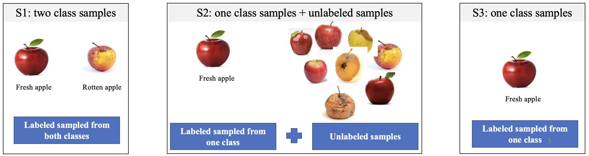
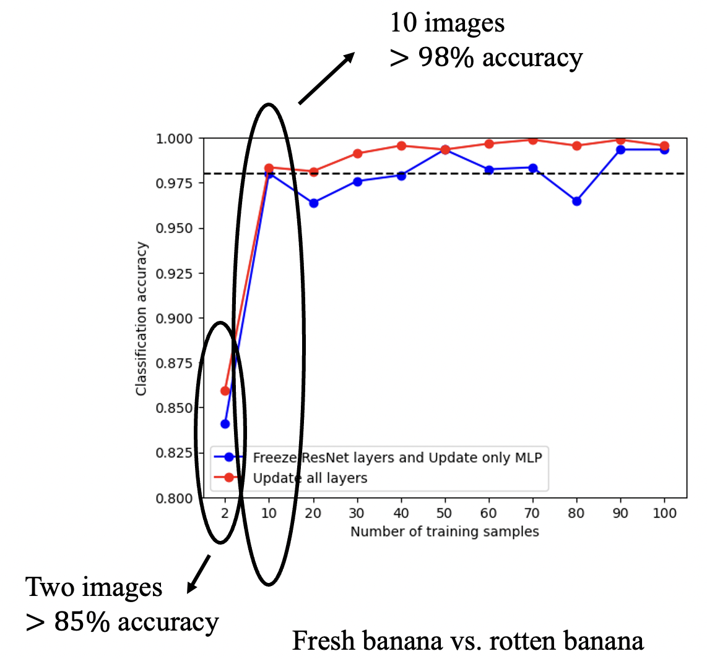

# ATLearn (Adaptive Transfer Learning) Toolkit
[](https://opensource.org/licenses/Apache-2.0)

## Introduction
ATLearn is a Transfer Learning toolkit that supports easy model building on top of the pre-trained models. 
It provides a set of APIs that enable users to load pre-trained models, build and train their customized 
transfer learning models, and export the models for inference and deployment.

## Functions
This toolkit now includes the transfer learning functions on image classification
and object detection. To be specific, we consider three scenarios for image classification (take binary
classification as an example), including:
* (S1) Two-Class Samples: The customers can provide the labeled training data from both classes. 
Note: this corresponds to standard transfer learning on image classification, and thus it can be applied
to multi-class classification scenario directly.
* (S2) Positive-Unlabeled Samples: For the training data provided by the customers, only limited samples from a positive class are labeled and others are unlabeled.
* (S3) One-Class Samples: The customers can provide the training data from only one class.


We provide transfer learning approaches for every scenario. Customers will be able to
choose different training strategies based on the types of training data they can collect. For object
detection, we implement the transfer learning based on YOLO models 
(e.g., [yolov5](https://github.com/ultralytics/yolov5)). It also supports one/multi class object 
detection.

## Why ATLearn?
<p align="center">
  
</p>

* Strong performance: It achieves high performance on image classification and object detection tasks.
* Small data: Transfer learning requires a very small number of training examples. For example,
it can only 2 input images (1 for fresh banana and 1 for rotten banana) to achieve 85% accuracy on distinguishing the fresh banana from rotten banana.
* Fast Convergence: Typically, when increasing the number of training samples, the model performance will 
improve until it converges to some point, i.e., increasing training examples will not affect the model performance
anymore. By using data augmentation techniques (e.g., [mixup](https://arxiv.org/abs/1710.09412)), ATLearn encourages
the fast convergence regarding the model performance. For example, it achieves 98% accuracy with only 10 
training examples.
* CPU: One benefit of transfer learning is to support training a large neural network (e.g., [ResNet-50](https://openaccess.thecvf.com/content_cvpr_2016/papers/He_Deep_Residual_Learning_CVPR_2016_paper.pdf)) with only CPU, 
due to the small size of training data.
* Easy to use: Below we provide some demos to show how easy it is on using ATLearn for model training.

## Demos
Here is a simple demo to show how to train the image classification model.

```
import ATLearn
from ATLearn import task, algorithm

model = ATLearn.get_model(task.IMAGE_CLASSIFICATION,
                          algorithm.IC_STANDARD_TRANSFER,
                          data="/path/to/data/",
                          network='resnet50',  # pre-trained model from torch
                          user_network=None)   # users' own model
model.train_model()
model.export(save_name="model", save_path="../")
```
Here is a simple demo to show freshness analysis.
```
import ATLearn
from ATLearn import task, algorithm

model = ATLearn.get_model(task.IMAGE_CLASSIFICATION,
                          algorithm.REGRESSION,
                          data="/path/to/data/",
                          network='resnet50',  # pre-trained model from torch
                          user_network=None)   # users' own model
model.train_model()
model.export(save_name="model", save_path="../")
```
Here is a simple demo to show real-time object detection on camera.
```
import ATLearn
from ATLearn import task, algorithm

model = ATLearn.get_model(task.OBJECT_DETECTION,
                          algorithm.OD_STANDARD_TRANSFER,
                          data="../data/FaceMasks/train/",
                          network="yolov5s")
model.train_model()
model.predict(input_data="camera", class_names=["A", "B"])
```

The exported model with torchscript format can be used for DJL project directly (see [DJL Demo](https://docs.djl.ai/jupyter/load_pytorch_model.html)).
The crucial step is to load the torchscript model as follows.
```
Criteria<Image, Classifications> criteria = Criteria.builder()
        .setTypes(Image.class, Classifications.class)
        .optModelPath(Paths.get("build/pytorch_models/myModel"))  // use my own model
        .optOption("mapLocation", "true") // this model requires mapLocation for GPU
        .optTranslator(translator)
        .optProgress(new ProgressBar()).build();

ZooModel model = criteria.loadModel();
```

## Test Data
Our demos use the following data sets: [[FaceMasks]](https://www.kaggle.com/datasets/andrewmvd/face-mask-detection?select=images),
[[Freshness]](https://www.kaggle.com/datasets/dcsyanwq/fuit-freshness), 
[[Fruit]](https://www.kaggle.com/datasets/sriramr/fruits-fresh-and-rotten-for-classification).

## Test Cases
The examples of image classification and object detection are given by
```
python test/demo.py
python test/demo_freshness.py
python test/demo_yolo.py
```
More parameter sections are illustrated as follows.
```
python test/demo.py --data path/to/data 
                    --network resnet50  // pre-trained model
                    --user_network None // whether to use your own model
                    --retrain False // Change model achietecture (e.g., add MLP layers)
                    --freeze True // Freeze the pre-traned layers
                    --gpu_id -1  // -1 denotes CPU
```

## Security

See [CONTRIBUTING](CONTRIBUTING.md#security-issue-notifications) for more information.

## License

This project is licensed under the Apache-2.0 License.
