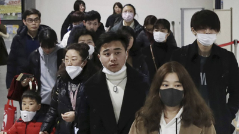
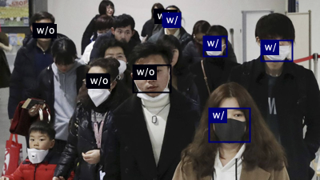

# Face Mask Detection

In this example, we apply pre-trained YOLOv5 model and fine-tune it on [Face Mask Detection dataset](https://www.kaggle.com/datasets/andrewmvd/face-mask-detection?select=images)
.The output model will be used to detect human face and classify it into two classes: with a mask or without mask. 
This example demonstrates how to apply transfer learning technique with YOLOv5. More specifically, the YOLOv5 layers near the input are frozen while those near the output are fine-tuned with the customized data.

After the training, the model is then exported to ONNX file, which can be loaded back for inference in python.

The source code is in [face_mask_detection.py](../face_mask_detection/src/face_mask_detection.py)

## Data preparation

The data set is downloaded from Kaggle contest [Face Mask Detection](https://www.kaggle.com/code/nasreehsamaae/face-mask-detection-yolov5)
. In this example, the data is stored in `examples/face_mask_detection/data/archive`. However, before the data is fed into YOLOv5, there is a data preparation 
step. See [Convert PASCAL VOC XML to YOLO for Object Detection](https://towardsdatascience.com/convert-pascal-voc-xml-to-yolo-for-object-detection-f969811ccba5)
.

## Training

In [face_mask_detection.py](../face_mask_detection/src/face_mask_detection.py), the code 
```python
model.train_model(model_file="../model_file/mask.pt")
```
will execute the model training. Here `model_file` specifies where to store the output model file.

In the directory `examples/face_mask_detection/model_file`, there are also two other files: `serving.properties` and 
`synset.txt`. They are used when loading this model into DJL, to specify the inference configuration. 

## Export YOLOv5 to ONNX
As illustrated in [YOLOv official document](https://github.com/ultralytics/yolov5/issues/251), the model convertion 
from `*.pt` to `*.onxx` is done by the following steps.
1. Download `export.py` to the same directory as the model file `*.pt` (`mask.pt` in this example).
2. Go to that directory and run
```bash
python export.py --weights mask.pt --include onnx
```
Then `mask.onnx` will be exported. This file can be loaded into Python inference code as shown below, or can be loaded 
into DJL.

## Inference

In [face_mask_detection.py](../face_mask_detection/src/face_mask_detection.py), the code 
```python
model.predict(input_data="../../figs/face_mask.png", class_names=["w/o", "w/"],
              conf_thres=0.415, model_file="../model_file/mask.onnx")
``` 
executes the inference task with the trained model in `model_file`. Here, the `input_data` is the picture file. 
Another option is `input_data="camera"`, which will trigure real-time inference with the video input. The 
`model_file` can also be specified to `../model_file/mask.pt` which does the inference with the saved pytorch model.

The example input picture is 
<p align="center">
  
</p>

The inference result is 
<p align="center">
  
</p>


